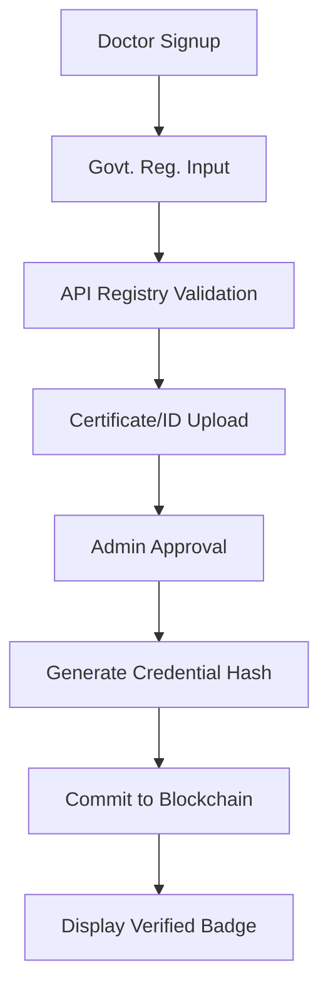

# Ayur-Well Pulse: System Architecture & Technical Design

## 1. System Overview
Ayur-Well Pulse is an integrated Ayurvedic Health Platform designed to bridge traditional wisdom with modern technology. The system provides a secure, scalable, and decentralized environment for patients, doctors, and dietitians to collaborate on personalized wellness plans.

## 2. Platform Architecture
The platform follows an **API-First, Hybrid-Cloud Architecture** with a focus on high availability, data residency, and security.

### 2.1 Backend Layer (Node.js & Express)
- **Engine**: Node.js with Express for high-performance asynchronous handling of telehealth and real-time logs.
- **Database**: **MongoDB (Mongoose)** was selected for its flexible schema, allowing for the dynamic nature of Ayurvedic health records (Prakriti, Vikriti, and lifestyle-dependent data) that vary significantly between individuals.
- **AI Microservices**: Specialized Python/Flask containers for:
  - Food Image Recognition (Computer Vision)
  - Natural Language Processing for Voice-to-Diet-Log
  - Nutrient Analysis (calculating macros/micros alongside Ayurvedic attributes).

### 2.2 Frontend Layer (React & Vite)
- **Core**: React 18 with Vite for a fast, responsive Single Page Application (SPA).
- **Styling**: Tailwind CSS and Shadcn UI components for a professional, Accessible (A11y), and "government-appropriate" aesthetic.
- **State Management**: React Context API for lightweight session and role management; TanStack Query for efficient data fetching and caching.

### 2.3 Decentralized Layer (Blockchain)
- **Platform**: **Hyperledger Fabric** (Permissioned Blockchain).
- **Logic**: Smart contracts handle **Consent Management**. No personal data is stored on-chain; only SHA-256 hashes of credentials, prescriptions, and record updates are stored to ensure auditability and prevent tampering.

## 3. Core Functional Flows

### 3.1 Doctor Verification Flow

### 3.2 Security & Compliance (DISHA/HIPAA Aligned)
- **At-Rest Encryption**: Sensitive patient metadata is encrypted using **AES-256-GCM** before being persisted in MongoDB.
- **In-Transit Encryption**: All communication via **TLS 1.3**.
- **Data Residency**: AWS/Azure/GCP regions pinned to **India (South/Central)** to ensure compliance with local data protection laws.
- **Audit Logs**: Immutable log entries for every read/write operation on patient records.

## 4. Technology Justification

| Technology | Justification |
| :--- | :--- |
| **MongoDB** | Vital for handling "unstructured" health data like Dosha profiles and varying symptom lists without rigid migrations. |
| **JWT (Auth)** | Provides stateless, scalable authentication suitable for the multi-role dashboard system. |
| **React + Vite** | Ensures the UI remains minimal and extremely fast, even on low-bandwidth rural connections. |
| **Hyperledger** | Necessary for satisfying government audit requirements for "Prescription Integrity" and "Practitioner Authenticity". |

## 5. Development Status (Smart India Hackathon Baseline)
The current implementation has established the **Core Auth/RBAC** and **Baseline Health Intake** infrastructure. The next phases focus on the **AI Nutrient Engine** and **E2E Telehealth Integration**.
